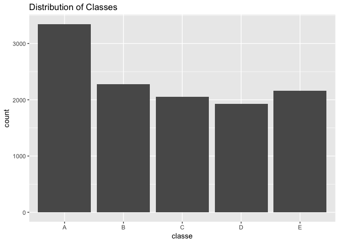

# Practical Machine Learning: Project
Manojkumar Parmar  
11/21/2016  


# About Data
## Background
Using devices such as Jawbone Up, Nike FuelBand, and Fitbit it is now possible to collect a large amount of data about personal activity relatively inexpensively. These type of devices are part of the quantified self movement – a group of enthusiasts who take measurements about themselves regularly to improve their health, to find patterns in their behavior, or because they are tech geeks. One thing that people regularly do is quantify how much of a particular activity they do, but they rarely quantify how well they do it. In this project, your goal will be to use data from accelerometers on the belt, forearm, arm, and dumbell of 6 participants. They were asked to perform barbell lifts correctly and incorrectly in 5 different ways. More information is available from the website here: http://groupware.les.inf.puc-rio.br/har (see the section on the Weight Lifting Exercise Dataset).

## Data

The training data for this project are available here:
https://d396qusza40orc.cloudfront.net/predmachlearn/pml-training.csv
The test data are available here:
https://d396qusza40orc.cloudfront.net/predmachlearn/pml-testing.csv
The data for this project come from this source: http://groupware.les.inf.puc-rio.br/har. If you use the document you create for this class for any purpose please cite them as they have been very generous in allowing their data to be used for this kind of assignment.

##Goal of the Analysis
The goal of your project is to predict the manner in which they did the exercise. This is the "classe" variable in the training set. You may use any of the other variables to predict with. You should create a report describing how you built your model, how you used cross validation, what you think the expected out of sample error is, and why you made the choices you did. You will also use your prediction model to predict 20 different test cases.

### Peer Review Portion

Your submission for the Peer Review portion should consist of a link to a Github repo with your R markdown and compiled HTML file describing your analysis. Please constrain the text of the writeup to < 2000 words and the number of figures to be less than 5. It will make it easier for the graders if you submit a repo with a gh-pages branch so the HTML page can be viewed online (and you always want to make it easy on graders :-).

# Data Cleaning & Basic analysis

## Getting Data

This method uses the URL provided to download files for training & test data.


```r
if(!file.exists("./projectdata")){
        dir.create("./projectdata")
}
downloadUrlTrain <- "https://d396qusza40orc.cloudfront.net/predmachlearn/pml-training.csv"
if(!file.exists("./projectdata/pml-training.csv")){
        download.file(downloadUrlTrain,destfile="./projectdata/pml-training.csv",method="curl")
}
downloadUrlTest <- "https://d396qusza40orc.cloudfront.net/predmachlearn/pml-testing.csv"
if(!file.exists("./projectdata/pml-testing.csv")){
        download.file(downloadUrlTest,destfile="./projectdata/pml-testing.csv",method="curl")
}
```


## cleaning Data

This method loads the data and cleans it. All the columns with **all missing values** are discarded. Same way **first 7 columns** are not helpful for prediction purpose and hence they are removed.


```r
trainData <- read.csv("./projectdata/pml-training.csv", 
                      na.strings = c("NA","#DIV/0!", ""))
testData <- read.csv("./projectdata/pml-testing.csv",
                     na.strings = c("NA","#DIV/0!", ""))
# delete colums with all missing values
trainData <- trainData[,colSums(is.na(trainData))==0]
testData <- testData[,colSums(is.na(testData))==0]
# remove unnecesary data as it is not relavant
trainData <- trainData[,-c(1:7)]
testData <- testData[,-c(1:7)]
```

## Generating training, testing & validation data

This method divides training data in to **training** part ($60$%), **testing** part ($20$%) & **validation** part ($20$%)


```r
set.seed(123)
inBuild <- createDataPartition(y = trainData$classe, p = 0.8, list = F)
buildData <- trainData[inBuild,]
validation <- trainData[-inBuild,]
inTrain <- createDataPartition(y = buildData$classe, p = 0.75, list = F)
training <- buildData[inTrain,]
testing <- buildData[-inTrain,]
```

Here are the dimensions of various subsets after split

```r
dim(validation)
```

```
## [1] 3923   53
```

```r
dim(training)
```

```
## [1] 11776    53
```

```r
dim(testing)
```

```
## [1] 3923   53
```

## Exploration of data

Exploration of predicted variable "**classe**" reveals that it is *uniform* in nature & hence model based analysis will yield poor results.


```r
qplot(classe,data=training, main="Distribution of Classes")
```

<!-- -->

There exist a **very high corelation** (> $0.8$) between predictors and hence "**pca**"$ needs to be used as preprocessor step.

```r
#find correlation
highCor <- findCorrelation(cor(training[,-53]), cutoff = 0.8)
names(training)[highCor]
```

```
##  [1] "accel_belt_z"     "roll_belt"        "accel_belt_y"    
##  [4] "accel_dumbbell_z" "accel_belt_x"     "magnet_belt_x"   
##  [7] "accel_arm_x"      "accel_dumbbell_x" "magnet_arm_y"    
## [10] "magnet_belt_z"    "gyros_forearm_y"  "gyros_dumbbell_x"
## [13] "gyros_dumbbell_z" "gyros_arm_x"
```

Following are **list of predictors** which are used to build model.

```r
#final predictors
names(training[,-53])
```

```
##  [1] "roll_belt"            "pitch_belt"           "yaw_belt"            
##  [4] "total_accel_belt"     "gyros_belt_x"         "gyros_belt_y"        
##  [7] "gyros_belt_z"         "accel_belt_x"         "accel_belt_y"        
## [10] "accel_belt_z"         "magnet_belt_x"        "magnet_belt_y"       
## [13] "magnet_belt_z"        "roll_arm"             "pitch_arm"           
## [16] "yaw_arm"              "total_accel_arm"      "gyros_arm_x"         
## [19] "gyros_arm_y"          "gyros_arm_z"          "accel_arm_x"         
## [22] "accel_arm_y"          "accel_arm_z"          "magnet_arm_x"        
## [25] "magnet_arm_y"         "magnet_arm_z"         "roll_dumbbell"       
## [28] "pitch_dumbbell"       "yaw_dumbbell"         "total_accel_dumbbell"
## [31] "gyros_dumbbell_x"     "gyros_dumbbell_y"     "gyros_dumbbell_z"    
## [34] "accel_dumbbell_x"     "accel_dumbbell_y"     "accel_dumbbell_z"    
## [37] "magnet_dumbbell_x"    "magnet_dumbbell_y"    "magnet_dumbbell_z"   
## [40] "roll_forearm"         "pitch_forearm"        "yaw_forearm"         
## [43] "total_accel_forearm"  "gyros_forearm_x"      "gyros_forearm_y"     
## [46] "gyros_forearm_z"      "accel_forearm_x"      "accel_forearm_y"     
## [49] "accel_forearm_z"      "magnet_forearm_x"     "magnet_forearm_y"    
## [52] "magnet_forearm_z"
```


# Model Building

## trainControl Parameter

Following training parameters are used for the model building.

- **Cross validation** method is used with **7 folds**
- **Principle component analysis** is used as pre processing step
- Parallel processing is allowed to build model


```r
# train control parameter
fitCtrl <- trainControl(method = "cv",number = 7, verboseIter = F, 
                        preProcOptions = c("pca"),
                        allowParallel = T)
```

## Model Selection

Model selection is carried out by **building multiple models** and later selecting best performing models based on **average accuracy**.
*Gradient boosting, random forest, support vector machine radial, support vecor machine linear, neuralnet & logit boost* are primary candidates.

### Evaluating multiple models

Models are build $10$ times and their respective accuracy is captured for all run.


```r
# generate dataframe over multiple prediction
predDf <- data.frame(run = 0, time = 0, gbm = 0, rf = 0, svmr = 0, 
                     svml = 0, nn = 0, lb = 0)
start.time.all = Sys.time() #log the starting time
# Run the model buiding 10 times & record accuracy over test set
for (i in 1:10){
        inTrain <- createDataPartition(y = buildData$classe, p = 0.75, list = F)
        training <- buildData[inTrain,]
        testing <- buildData[-inTrain,]
        dim(validation)
        dim(training)
        dim(testing)
        #Start building model
        start.time = Sys.time()
        mod.gbm <- train(classe ~ . , data= training , method = "gbm", 
                         trControl = fitCtrl, verbose = F)
        mod.rf <- train(classe ~ . , data= training , method = "rf", 
                        trControl = fitCtrl, verbose = F)
        mod.svmr <- train(classe ~ . , data= training , method = "svmRadial", 
                          trControl = fitCtrl, verbose = F)
        mod.svml <- train(classe ~ . , data= training , method = "svmLinear", 
                         trControl = fitCtrl, verbose = F)
        mod.nn <- train(classe ~ . , data= training , method = "nnet", 
                        trControl = fitCtrl, verbose = F)
        mod.lb <- train(classe ~ . , data= training , method = "LogitBoost", 
                        trControl = fitCtrl, verbose = F)
        stop.time = Sys.time()
        
        #Predictions
        pred_val <- c( i, (stop.time - start.time),
                        unname(confusionMatrix(predict(mod.gbm, testing), 
                                               testing$classe)$overall[1]),
                        unname(confusionMatrix(predict(mod.rf, testing), 
                                               testing$classe)$overall[1]),
                        unname(confusionMatrix(predict(mod.svmr, testing), 
                                               testing$classe)$overall[1]),
                        unname(confusionMatrix(predict(mod.svml, testing), 
                                               testing$classe)$overall[1]),
                        unname(confusionMatrix(predict(mod.nn, testing), 
                                               testing$classe)$overall[1]),
                        unname(confusionMatrix(predict(mod.lb, testing), 
                                               testing$classe)$overall[1]))
        predDf <- rbind(predDf, pred_val)
}
stop.time.all = Sys.time()
#calculate total time for execution
print(stop.time.all - start.time.all)
#correct the prediction frame
predDf <- predDf[-1,]
```

### Accuracy of multiple models

Following shows the **accuracy** of all models for **all runs**. Please note that models are refereed by short names.


```r
rownames(predDf) <- NULL
kable(predDf[,-c(2)], digits = 3)
```


 run     gbm      rf    svmr    svml      nn      lb
----  ------  ------  ------  ------  ------  ------
   1   0.963   0.993   0.916   0.783   0.401   0.909
   2   0.958   0.992   0.925   0.788   0.441   0.893
   3   0.962   0.990   0.922   0.782   0.429   0.900
   4   0.958   0.993   0.923   0.771   0.403   0.887
   5   0.963   0.993   0.925   0.780   0.420   0.896
   6   0.954   0.988   0.923   0.778   0.401   0.894
   7   0.959   0.991   0.924   0.781   0.465   0.898
   8   0.956   0.988   0.914   0.773   0.500   0.890
   9   0.959   0.991   0.913   0.776   0.396   0.877
  10   0.964   0.992   0.921   0.784   0.369   0.889

**Average accuracy** of all runs for all models are as per following

```r
modAccuracy <- data.frame(colMeans(predDf[,-c(1,2)]))
colnames(modAccuracy) <- "Avg. Accuracy"
kable(t(modAccuracy), digits = 3)
```

                  gbm      rf   svmr   svml      nn      lb
--------------  -----  ------  -----  -----  ------  ------
Avg. Accuracy    0.96   0.991   0.92   0.78   0.422   0.893

From average accuracy point of view, **random forrest** is **best** performing model. *Gradient boosting* and *support vector machine radial* are respectively *second* and *third* best model.

### Selection of final set of Models & out of sample accuracy

Best models are used to predict values on **validation data set** (only once) for calculation of "**out of sample**" accuracy.


```r
validAccuracy <- data.frame(Accuracy = c(
confusionMatrix(predict(mod.rf, validation), validation$classe)$overall[1],
confusionMatrix(predict(mod.gbm, validation), validation$classe)$overall[1],
confusionMatrix(predict(mod.svmr, validation), validation$classe)$overall[1]))
rownames(validAccuracy) <- c("rf", "gbm", "svmr")
kable(t(validAccuracy), digits = 3)
```

               rf     gbm    svmr
---------  ------  ------  ------
Accuracy    0.991   0.962   0.918

From "**out of sample**" accuracy point of view, **random forrest** is **best** performing model. *Gradient boosting* and *support vector machine radial* are respectively *second* and *third* best model.

Hence random forest is used for building final model.

## Final Model

**Random forest** model is built over *original training dataset*.


```r
# Rf is best 
finMod.rf <- train(classe ~ . , data= trainData , method = "rf", 
                trControl = fitCtrl, verbose = F)
```

## Model agreement accuracy

On original test set($20$ case), actual values are not available and hence to improve prediction confidence level various **model agreement accuracy** is used.
Here additionally, gradient boosting and support vector machine radial models are built on original training dataset.


```r
# gbm for agreement accuracy
finMod.gbm <- train(classe ~ . , data= trainData , method = "gbm", 
                   trControl = fitCtrl, verbose = F)

#svmr for agreement accuracy
finMod.svmr <- train(classe ~ . , data= trainData , method = "svmRadial", 
                        trControl = fitCtrl, verbose = F)
```

Prediction values are generated for all 3 models and used for checking model agreement accuracy

```r
#predict from 3 different best model
predFin.rf <- predict(finMod.rf,testData)
predFin.gbm <- predict(finMod.gbm,testData)
predFin.svmr <- predict(finMod.svmr, testData)
#check for agreement accuracy
modAgreementAccuracy <- data.frame(Agreement.Accuracy = c(
        confusionMatrix(predFin.gbm,predFin.rf)$overall[1],
        confusionMatrix(predFin.svmr,predFin.rf)$overall[1]))
rownames(modAgreementAccuracy) <- c("gbm vs. rf", "svmr vs. rf")
kable(t(modAgreementAccuracy), digits = 3)
```

                      gbm vs. rf   svmr vs. rf
-------------------  -----------  ------------
Agreement.Accuracy             1             1

Since all 3 models are in full agreement of predicted values, confidence in **random forest** model is increased to very high level.

# Final prediction

Here is the final predicted values for test cases provided.


```r
# Final prediction
finPred <- data.frame(prediction = predFin.rf)
rownames(finPred) <- 1:length(predFin.rf)
kable(t(finPred))
```

             1    2    3    4    5    6    7    8    9    10   11   12   13   14   15   16   17   18   19   20 
-----------  ---  ---  ---  ---  ---  ---  ---  ---  ---  ---  ---  ---  ---  ---  ---  ---  ---  ---  ---  ---
prediction   B    A    B    A    A    E    D    B    A    A    B    C    B    A    E    E    A    B    B    B  

# Reproducibility

Following is session-info to list respective packages along with their versions


```r
sessionInfo()
```

```
## R version 3.3.2 (2016-10-31)
## Platform: x86_64-apple-darwin13.4.0 (64-bit)
## Running under: macOS Sierra 10.12.1
## 
## locale:
## [1] en_US.UTF-8/en_US.UTF-8/en_US.UTF-8/C/en_US.UTF-8/en_US.UTF-8
## 
## attached base packages:
## [1] splines   parallel  stats     graphics  grDevices utils     datasets 
## [8] methods   base     
## 
## other attached packages:
##  [1] kernlab_0.9-25      plyr_1.8.4          gbm_2.1.1          
##  [4] survival_2.40-1     doParallel_1.0.10   iterators_1.0.8    
##  [7] foreach_1.4.3       knitr_1.15          randomForest_4.6-12
## [10] caret_6.0-73        ggplot2_2.2.0       lattice_0.20-34    
## 
## loaded via a namespace (and not attached):
##  [1] Rcpp_0.12.8        highr_0.6          nloptr_1.0.4      
##  [4] class_7.3-14       tools_3.3.2        digest_0.6.10     
##  [7] lme4_1.1-12        evaluate_0.10      tibble_1.2        
## [10] nlme_3.1-128       gtable_0.2.0       mgcv_1.8-16       
## [13] Matrix_1.2-7.1     yaml_2.1.14        SparseM_1.74      
## [16] e1071_1.6-7        stringr_1.1.0      MatrixModels_0.4-1
## [19] stats4_3.3.2       grid_3.3.2         nnet_7.3-12       
## [22] rmarkdown_1.1      minqa_1.2.4        reshape2_1.4.2    
## [25] car_2.1-3          magrittr_1.5       scales_0.4.1      
## [28] codetools_0.2-15   ModelMetrics_1.1.0 htmltools_0.3.5   
## [31] MASS_7.3-45        assertthat_0.1     pbkrtest_0.4-6    
## [34] colorspace_1.3-1   labeling_0.3       quantreg_5.29     
## [37] stringi_1.1.2      lazyeval_0.2.0     munsell_0.4.3
```

Hint : Majority of code here is executed separately and work space was saved. Saved work space is used to create this report. Model selection process is very time consuming (took on my machine 3.75 hr with parallel processing enable).


